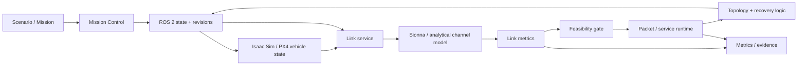

# SWARMSYM / NETLAB — Swarm Network-as-a-Service Simulation Framework

<p align="center">
  <strong>ROS 2 · PX4 · Isaac Sim · NVIDIA Sionna · communication-aware multi-UAV autonomy · topology adaptation · failure recovery</strong>
</p>

<p align="center">
  
</p>

## Research objective

SWARMSYM studies UAV swarms used as **reconfigurable airborne communication infrastructure**. The research question is whether the swarm can maintain an end-to-end service while vehicle geometry, wireless conditions, failures, and network topology change together.

The framework couples:

- embodied multi-UAV motion;
- wireless-link evaluation;
- graph/topology state;
- packet/service progression;
- failure injection and recovery;
- synchronized experiment evidence.

A route is considered operational only when it exists in the current graph and every active hop satisfies the configured communication constraints.

---

## 1. System architecture



The runtime is revision-based: topology, traffic, antennas, failures, world state, and swarm state are validated and acknowledged before they are treated as committed experiment state.

---

## 2. Time-varying swarm graph

At time `t`, the swarm is represented by

```math
G(t)=(V(t),E(t)).
```

Let the set of failed or unavailable UAVs be

```math
F(t)\subseteq V(t).
```

The active set is

```math
V_a(t)=V(t)\setminus F(t).
```

For positions `p_i(t)` and `p_j(t)`,

```math
d_{ij}(t)=\|p_i(t)-p_j(t)\|_2.
```

Geometric proximity is necessary for many configurations, but it is not sufficient for a valid communication edge.

---

## 3. Communication model

### 3.1 Link budget

The analytical received-power balance is

```math
P_{\mathrm{rx},ij}
=
P_{\mathrm{tx},i}
+
G_{\mathrm{tx},i}
+
G_{\mathrm{rx},j}
-
L_{\mathrm{total},ij}.
```

Thermal-noise power is modeled as

```math
N_{\mathrm{dBm}}
=
-174
+
10\log_{10}(B)
+
NF,
```

where `B` is receiver bandwidth and `NF` is noise figure.

A signal-quality quantity is then formed from the selected SNR/SINR model.

### 3.2 Theoretical capacity

The channel-capacity abstraction is

```math
C_{ij}
=
\eta B\log_2(1+\mathrm{SINR}_{ij}),
```

where `eta` is the configured efficiency factor.

> `C_ij` is a theoretical channel metric. Application-layer throughput is reported separately when it is produced by the corresponding experiment.

---

## 4. Link-feasibility gate

A compact nominal gate is

```math
g_{ij}(t)
=
I[d_{ij}\le d_{max}]\,I[\mathrm{SINR}_{ij}\ge\gamma],I[C_{ij}\ge C_{min}]\,I[\Delta t_{ij}\le T_{fresh}].
```

Failure-aware feasibility additionally requires active endpoints:

```math
g^F_{ij}(t)
=
g_{ij}(t)\,I[i\in V_a(t)]\,I[j\in V_a(t)].
```

For a path `P`, a simple all-hops-feasible condition is

```math
\chi_P(t)
=
\prod_{(i,j)\in P}
g^F_{ij}(t).
```

Thus `chi_P = 1` only when every active hop passes the configured feasibility predicates.

---

## 5. Topology semantics

Different topology modes correspond to different service semantics:

| Mode | Runtime interpretation |
|---|---|
| **Chain** | one infeasible active hop pauses the end-to-end path |
| **Parallel** | branch cursors progress independently |
| **Forest** | service state is maintained per branch/subtree |
| **Manual** | operator-defined edges are retained but still checked by the physical/communication gate |

The implementation distinguishes between **graph connectivity** and **service connectivity**. A connected graph can still fail the service requirement if one or more active hops violate range, freshness, SNR/SINR, capacity, or node-health constraints.

---

## 6. Failure and recovery

A node failure first changes the active graph, then forces route/service reevaluation.

```text
nominal service
→ failure injected or detected
→ node removed from active set
→ incident links invalidated
→ affected route becomes infeasible
→ replacement topology proposed
→ link metrics recomputed
→ feasibility gate re-evaluated
→ ROS 2 / link service / simulator acknowledge revision
→ service resumes after replacement route is feasible
```

The sequence separates topology reconfiguration from service recovery: a new path is not accepted until the corresponding communication conditions are satisfied.

<p align="center">
  
</p>

---

## 7. Sionna communication layer

The communication layer can operate at multiple fidelity levels, from fast analytical models to geometry-aware Sionna evaluation.

<p align="center">
  
  
  
</p>

These fields provide communication state to the routing and autonomy layers. Geometry-aware simulation outputs and field measurements are kept as separate evidence sources.

---

## 8. Operational evidence

### Embodied urban swarm

<p align="center">
  <a href="https://raw.githubusercontent.com/kosmicplane/kosmicplane.github.io/main/assets/media/projects/swarmsym-city.mp4">
    
  </a>
</p>

### Dynamic topology

<p align="center">
  <a href="https://raw.githubusercontent.com/kosmicplane/kosmicplane.github.io/main/assets/media/projects/swarmsym-topology.mp4">
    
  </a>
</p>

### Relay state / standby recovery

<p align="center">
  <a href="https://raw.githubusercontent.com/kosmicplane/kosmicplane.github.io/main/assets/media/projects/swarmsym-relay-state.mp4">
    
  </a>
</p>

> Click a figure to open the corresponding MP4.

---

## 9. Model fidelity

The framework keeps simulation fidelity explicit:

| Level | Interpretation |
|---|---|
| **F0** | mission/layout preview |
| **F1** | analytical motion and communication abstractions |
| **F2** | stochastic traffic/channel/failure studies |
| **F3** | geometry-aware Sionna evaluation |
| **F4** | external protocol-aware co-simulation |
| **F5** | optional autopilot-level execution |

The fidelity label is carried with each experiment so that analytical capacity, packet simulation, geometry-aware radio estimates, and autopilot behavior can be compared without conflating their assumptions.

---

## 10. Metrics

### Communication

- received power and path loss;
- SNR / SINR;
- theoretical capacity;
- delay and jitter;
- packet delivery ratio;
- throughput/goodput when produced by the corresponding runtime layer;
- outage duration;
- queue state;
- Age of Information.

### Topology

- connected components;
- hop count;
- node degree;
- graph diameter;
- articulation points and bridges;
- path diversity;
- disjoint paths;
- algebraic connectivity;
- topology churn;
- failed-node tolerance.

A standard algebraic-connectivity metric is the second-smallest eigenvalue of the graph Laplacian:

```math
\lambda_2(L).
```

A positive `lambda_2` indicates connectivity for an undirected graph representation; its magnitude is used only as a graph-level robustness indicator, not as a radio-quality metric.

---

## 11. Validation strategy

The validation pipeline separates three questions:

1. **internal consistency:** do synchronized components agree on configuration, revision, timing, and topology state?
2. **model plausibility:** do link metrics change consistently with geometry, channel settings, and failures?
3. **external comparison:** do analogous scenarios remain consistent with trends from external datasets such as AirPAW?

AirPAW-derived comparisons are used as an external plausibility check for communication trends rather than as a direct reproduction of the simulated KAUST scenes.

---

## 12. Runtime stack

- **Mission Control** — scenario design, telemetry, topology, traffic, failures, diagnostics, evidence.
- **ROS 2** — typed state coordination, revisions, packet/service runtime, acknowledgements.
- **Isaac Sim** — embodied vehicle/world state.
- **PX4** — optional autopilot execution path.
- **Sionna-compatible link service** — received power, SNR/SINR, capacity, delay, feasibility.
- **Evidence layer** — metrics, logs, hashes, manifests, plots, and experiment artifacts.

---

## 13. Running the framework

### Clean installation

```bash
cd ~/NETLAB
chmod +x scripts/netlab scripts/*.sh Docker/scripts/*.sh Docker/workspace/ros2/*.sh
./scripts/bootstrap_host.sh --non-interactive
```

### Daily operation

```bash
cd ~/NETLAB
./scripts/netlab launch
./scripts/netlab status
./scripts/netlab packet-doctor
./scripts/netlab sync-doctor
./scripts/netlab smoke-test
./scripts/netlab stop
```

Mission Control is served on port `8765`.

---

## 14. Repository structure

```text
apps/mission_control/       Mission Control backend and frontend
netlab/                     state, synchronization, models, runtime
Docker/                     compose, Isaac, ROS 2, Sionna, optional PX4
plugins/                    research algorithm packages
scenarios/                  validated experiments and regressions
schemas/                    experiment and API contracts
openapi/                    Mission Control API
reports/                    validation / performance reports
tests/                      unit, integration, scientific tests
docs/                       architecture, operator, research documentation
```

---

## 15. Verification

```bash
PYTHONPATH=. python3 -m unittest discover -s tests -p 'test_*.py' -v
python3 tests/run_all.py
./scripts/diagnostics/validate_release.sh
./scripts/netlab target-acceptance --embedded
```

Target-system acceptance:

```bash
./scripts/netlab target-acceptance
```

---

## 16. Documentation

- [System architecture](docs/architecture/system_architecture.md)
- [Synchronization protocol](docs/architecture/synchronization_protocol.md)
- [Mathematical model](docs/research/mathematical_model.md)
- [Model credibility](docs/research/model_credibility.md)
- [Research playbook](docs/research/research_playbook.md)
- [Algorithm benchmark protocol](docs/research/algorithm_benchmark_protocol.md)
- [Known limitations](docs/research/known_limitations.md)
- [Validation report](VALIDATION.md)

---

## Validation scope

SWARMSYM is a simulation and experimentation framework. Analytical link quantities, Sionna-derived radio estimates, simulated packet/service state, and embodied UAV behavior retain separate provenance throughout the pipeline, allowing results to be interpreted at the fidelity level that produced them.
